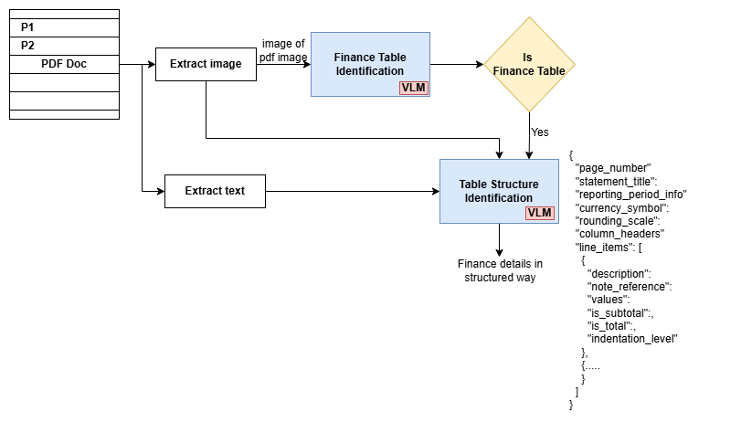

# Financial Table Detection and Extraction from PDFs using Local LLMs with Ollama

This document outlines the workflow of a Python script designed to automatically identify pages containing financial tables within PDF documents and then extract structured data from those tables. It uses local Large Language Models (LLMs) via Ollama for both detection and extraction tasks.

## Goal

The primary goal is to process PDF financial reports (or similar documents) page by page to:
1.  Determine if a page contains one or more financial data tables.
2.  If a table is present, extract its content (title, period, currency, headers, line items with values, etc.) into a structured JSON format.

This automates a typically manual and time-consuming data entry and analysis process.

## High-Level Workflow

The script processes a PDF document sequentially, page by page:

0. **Initial Stage**
- Identify Requirements
-- Model Selection  
Gemma3 is used for this experiment because it is `open source`, `suitable for commercial applications`, and `can be fine-tuned for specific use cases` using LoRA techniques. It is `available in different parameter sizes` and `can be deployed on a single GPU`.

## Example Workflow Diagram



*Figure: High-level workflow for financial table detection and extraction from PDFs using local LLMs with Ollama.*


1.  **PDF Input & Page Iteration**:
    * The script takes a path to a PDF file as input.
    * It iterates through each page of the PDF (or a specified number of pages).

2.  **For Each Page - Stage 1: Table Detection**:
    * **Image Conversion**: The current PDF page is converted into an image format (e.g., PNG) using PyMuPDF (Fitz). This image is encoded in base64.
    * **LLM Call (Image-based)**: The page image is sent to a multimodal LLM (e.g., Gemma3) hosted by Ollama.
    * **Prompt for Detection**: The LLM is prompted with specific instructions to analyze the image and determine if it primarily contains a financial data table.
    * **Response**: The LLM responds with a JSON indicating "YES" (table present) or "NO".

3.  **For Each Page - Stage 2: Data Extraction (Conditional)**:
    * This stage is executed **only if Stage 1 identified a table ("YES")** on the current page.
    * **Text Extraction**: The raw text content of the current PDF page is extracted using PyMuPDF (Fitz).
    * **LLM Call (Image + Text-based)**: Both the page image (from Stage 1) AND the extracted page text are sent to the multimodal LLM (VLM) via Ollama.
    * **Prompt for Extraction**: The LLM is given a detailed prompt instructing it to extract specific financial data elements (statement title, reporting period, currency, column headers, line items with their descriptions, note references, values, subtotal/total flags, and indentation levels) and structure this information into a predefined JSON format.
    * **Response**: The LLM aims to return the extracted data as a single JSON object.

4.  **Results Aggregation & Output**:
    * The result for each processed page (either the status from Stage 1 like "NO", "ERROR_CONVERSION", or the structured JSON data/error message from Stage 2) is stored.
    * Finally, all results are printed to the console and typically saved to a JSON file for further use.

## Key Technologies Used

* **Python**: The scripting language.
* **Ollama**: For running and managing local LLMs. ([https://ollama.com/](https://ollama.com/))
* **Multimodal LLM**: A model capable of processing both text and images (e.g., Gemma, Phi, LLaVA, BakLLaVA), served via Ollama.
* **PyMuPDF (Fitz)**: Python library for PDF manipulation, including page rendering to image and text extraction.
* **`ollama` Python Library**: For interacting with the Ollama API.

## Setup Instructions

### 1. Set up Ollama and Download an LLM

Ollama allows you to run powerful open-source LLMs locally on your machine.

* **Download Ollama**:
    * Go to the official Ollama website: [https://ollama.com/](https://ollama.com/)
    * Download the installer for your operating system (macOS, Linux, Windows).

* **Verify Ollama Installation (Optional but Recommended)**:
    * Once installed, Ollama should be running in the background (system tray on Windows/macOS, or as a service on Linux).
    * You can open a terminal or command prompt and type `ollama list` to see if it responds (it will show no models initially).
* **Pull a Multimodal LLM**:
    The script requires a multimodal model. LLaVA is a popular choice. Open your terminal/command prompt and run:
    ```bash
    ollama pull gemma3:4b
    ```
* **Ensure Ollama is Running**: Before running the Python script, make sure the Ollama application/service is active.

### 2. Run the setup
    ```bash
    pip install ollama pymupdf
    ```

### 3. Set up the Python Script

* **Save the Script**: Save the provided Python code as a `.py` file (e.g., `process_and_extract.py`).
* **`llm_utils.py`**:
    * The script imports utilities from `llm_utils.py` (like `OLLAMA_MULTIMODAL_MODEL`, `OLLAMA_HOST`, `convert_pdf_page_to_image_base64`, etc.).
    * Ensure you have this `llm_utils.py` file in the same directory or your Python path, or that the placeholder functions within the main script are adequate for your initial testing.
* **Configure Script Variables**:
    * Open the script (`process_and_extract.py`) and check the following variables, especially in the `if __name__ == "__main__":` block:
        * `PDF_FILE_PATH`: Set this to the path of the PDF document you want to process.
        * `TOTAL_PAGES_TO_PROCESS`: Set to `None` to process all pages, or an integer to limit the number of pages.
        * `IMAGE_CONVERSION_DPI`: Adjust if needed (default is usually 150).

## Running the Script

1.  Ensure Ollama is running and the specified multimodal model has been downloaded (`ollama pull gemma3:4b`).
2.  Activate your Python virtual environment (if you created one).
3.  Navigate to the directory where you saved the script.
4.  Execute the script from your terminal:
    ```bash
    python process_single.py - Process a single page at a time.
    python process_batch.py - Process multiple pages at one LLM call. Accuracy may be compromised if you use a low-end VLM.
    ```

## Interpreting the Output

* **Console Output**: The script will print progress messages to the console, including:
    * Which page is being processed.
    * The status of table detection (Stage 1).
    * If a table is detected, the status of data extraction (Stage 2).
    * LLM metrics (if `print_llm_metrics` is implemented).
    * A summary of results at the end.
* **JSON Output File**:
    * The script is configured to save the detailed results (including any extracted JSON data or error messages for each page) into a file named `extraction_results.json` in the same directory as the input PDF (or the script's directory if the PDF is in the root).
    * This JSON file provides a structured record of the entire processing run. Pages with successfully extracted tables will have their data nested as a JSON object. Other pages will show their detection status (e.g., "NO" for no table, or an error code).

This setup and workflow should enable you to start processing your PDF documents for financial table information. Remember that the quality of extraction heavily depends on the LLM's capabilities and the clarity of the prompts.


**Considerations to Select a Model for Deployment**
1.  **Model Size:** Larger models (more parameters) need more memory just to be loaded.
2.  **Input Tokens:** The length of your input text. More tokens = more memory.
3.  **Output Tokens:** The length of the generated text. More tokens = more memory.

---
#### Example Memory Calculation 📝

Let's say you have a GPU with **24 GB of VRAM**.

1.  **Model Loading:**
    * You choose a **7 Billion parameter model**.
    * If using 16-bit precision (bfloat16), each parameter takes 2 bytes.
    * Memory for model weights = $7 \text{ billion parameters} \times 2 \text{ bytes/parameter} = 14 \text{ GB}$.

2.  **Remaining Memory for Processing:**
    * $24 \text{ GB (Total VRAM)} - 14 \text{ GB (Model Weights)} = 10 \text{ GB}$ available for inputs, outputs, and activations.

3.  **Input/Activation Memory (Simplified):**
    * Let's estimate that for your chosen model and a reasonable input length (e.g., a few pages, say 2000 tokens), the combined memory for input token embeddings and activation caches might be around **4-6 GB**.

4.  **Output Token Memory:**
    * If you're generating a moderate output (e.g., 500 tokens), this might take an additional **0.5 - 1 GB** (varies).

5.  **Total Estimated Usage:**
    * Model: 14 GB
    * Input/Activations: ~5 GB
    * Output: ~0.5 GB
    * **Total: ~19.5 GB**

**Conclusion for this example:**
With ~19.5 GB used, you'd have roughly 4.5 GB of VRAM spare on your 24 GB card. This setup could handle the input of a few pages. If you needed to process many more pages at once (longer input tokens), you would exceed the 10 GB available after loading the model, requiring either a smaller model, quantization, or processing the document in smaller chunks.
