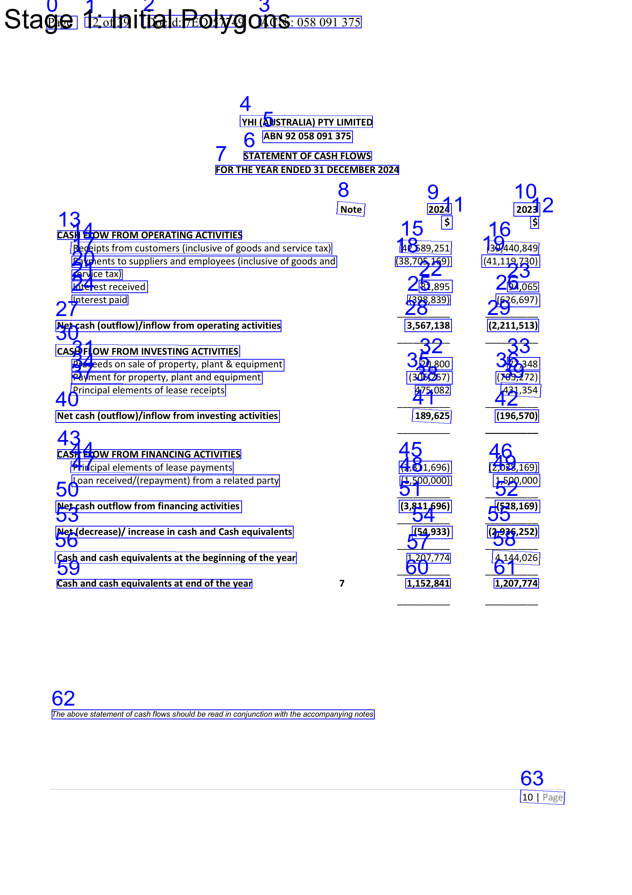
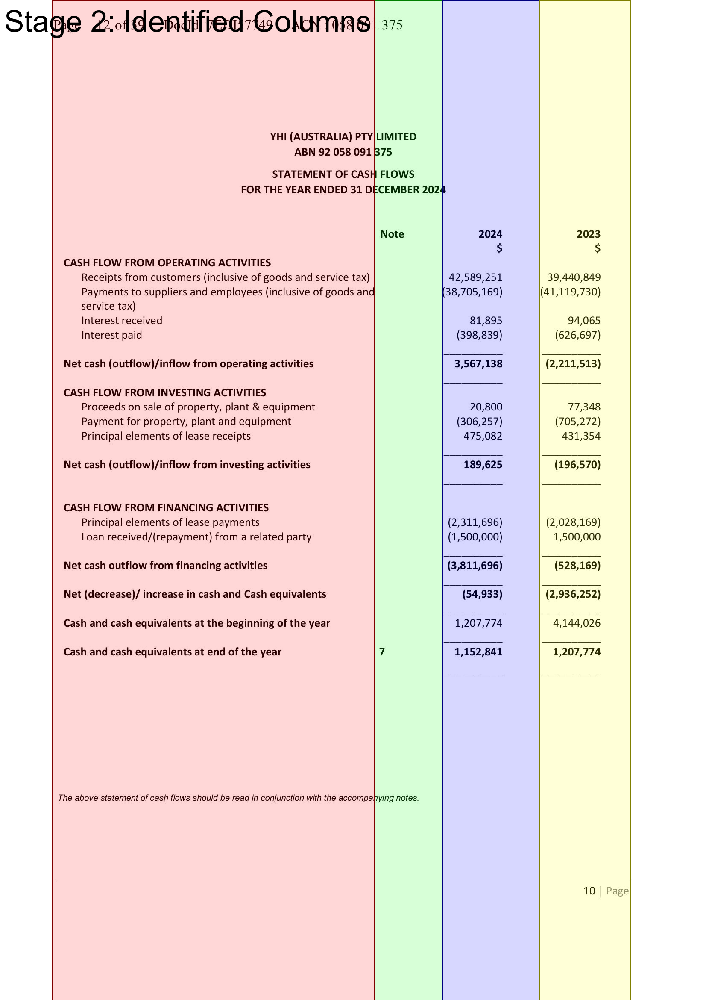
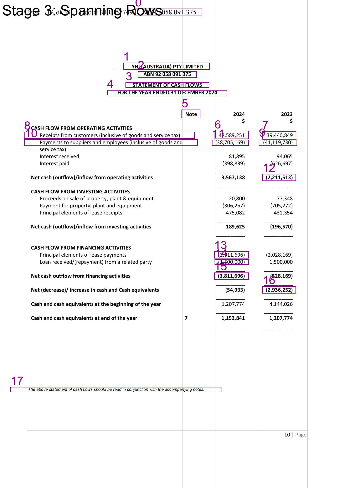
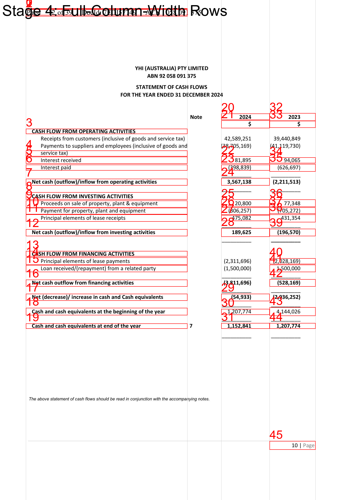
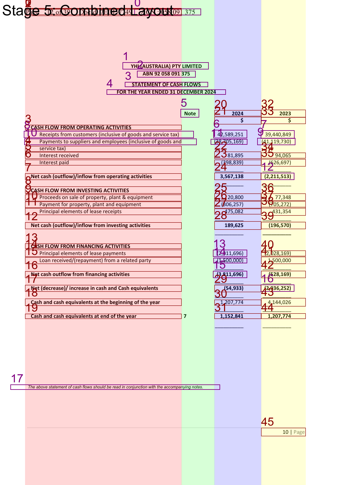

# Document Layout Analysis from OCR Data

## 1. Overview

This experiment provides a Python-based pipeline for performing Optical Character Recognition (OCR) on a document image, analyzing its layout structure (identifying columns and rows), and visualizing the different stages of this analysis. The goal is to understand the spatial organization of text within a document, which is a crucial step for various document understanding tasks such as information extraction and data parsing, especially from semi-structured documents like financial statements.

## 2. Core Idea

The core idea is to process a document image through a series of steps:
1. **Table Detection**: Identify the table area in the document image. For that the state-of-the-art (SOTA) table detection model, "microsoft/table-transformer-detection" model, is used. From that, the bounding box coordinates of only the table are extracted.
2. **OCR Text Extraction**: Use an OCR engine (PaddleOCR in this implementation) to extract text and its bounding box coordinates of each text from the image.
3. **Layout Analysis**:
    * **Column Identification**: Detect vertical columns in the document. This can be done using a simple projection profile method or a more advanced keyword-based approach (e.g., identifying "Note" and "Year" headers in financial tables).
    * **Row Formation**: Group individual text boxes (words/phrases) into logical rows, considering their vertical alignment and horizontal proximity.
    * **Element Classification**: Distinguish between rows that span multiple columns (e.g., titles, headers) and rows that are confined within a single column.
3.  **Visualization**: Generate images that illustrate each key step of the layout analysis, helping to debug and understand the process.

## 3. Modules

The project is structured into several Python modules:

### a. `ocr_utils.py`

* **Purpose**: Handles the OCR process and initial visualization of raw OCR results.
* **Key Functions**:
    * `predict_and_visualize_ocr()`: Initializes the PaddleOCR engine, performs OCR on a given image, and returns the detected text, bounding boxes, scores, and an image annotated with this raw OCR data.
    * `custom_draw_ocr()`: A utility to draw OCR bounding boxes and text onto an image with more styling options than the default PaddleOCR visualizer.

### b. `layout_analysis.py`

* **Purpose**: Contains the core logic for analyzing the document structure from the OCR output.
* **Core Logic & Key Functions**:
    * **Bounding Box Utilities**:
        * `convert_to_axis_aligned()`: Converts polygonal bounding boxes from OCR into axis-aligned rectangles.
        * `expand_box_horizontally()`: Slightly expands boxes to help in merging adjacent words.
        * `check_vertical_alignment()`: Determines if two boxes are vertically aligned enough to be part of the same row.
    * **Row Formation**:
        * `create_rows_from_boxes()`: Merges individual text boxes into larger row boxes based on alignment and proximity.
    * **Column Identification**:
        * `identify_columns_simple()`: A fallback method that uses a horizontal projection profile of text boxes to find gaps and thus infer column boundaries.
        * `identify_columns_by_dynamic_years()`: A more sophisticated method tailored for documents like financial statements. It looks for a primary keyword (e.g., "Note") and then dynamically searches for subsequent year headers (e.g., "2023", "2024") on the same vertical level to define column boundaries. This is the primary method used if `col_id_method` is set to `'keywords_else_simple'` or `'keywords_only'`.
    * **Orchestration**:
        * `process_document_layout_with_ocr()`: The main function in this module. It takes the raw OCR data, applies column identification, distinguishes between spanning rows and in-column rows, and refines these rows to fit the identified column structure.

### c. `visualize_layout.py`

* **Purpose**: Dedicated to generating visual outputs for each stage of the layout analysis.
* **Key Functions**:
    * `draw_boxes_on_image_direct()`: A flexible function to draw various types of boxes (polygons, rectangles) with labels on an image.
    * `visualize_layout_stages_on_image()`: Creates and saves a series of images, each highlighting a specific step: initial OCR boxes, identified columns with transparent overlays, detected spanning rows, and finally, rows adjusted to full column widths.

### d. `main_processor.py`

* **Purpose**: Serves as the main entry point and orchestrator for the entire pipeline.
* **Functionality**:
    * Configures paths, OCR language, and visualization parameters.
    * Calls `ocr_utils.py` to perform OCR.
    * Passes the OCR results to `layout_analysis.py` to get the structured layout (columns, rows).
    * Uses `visualize_layout.py` to generate and save the step-by-step visualization images.
    * Includes a fallback to create a dummy image if the specified input image is not found, allowing the script to run for demonstration.

## 4. Workflow Visualization

The following images illustrate the output at different stages of the layout analysis pipeline for a sample document:

**Stage 1: Initial OCR Polygons**
*(Shows the raw text boxes detected by PaddleOCR)*


**Stage 2: Identified Columns**
*(Highlights the detected vertical columns with colored overlays. The example shows columns for Description, Note, Year 1, Year 2)*


**Stage 3: Spanning Rows**
*(Shows rows that have been identified as spanning across multiple columns, such as main section headers)*


**Stage 4: Full Column-Width Rows**
*(Shows rows that are contained within single columns, with their horizontal extent adjusted to the full width of their respective columns)*


**Stage 5: Combined Layout**
*(Presents a consolidated view with column overlays, spanning rows, and full-width in-column rows, giving a comprehensive picture of the analyzed layout)*


## 5. Setup & Usage

1.  **Prerequisites**:
    * Ensure Python 3.x is installed.
    * Install necessary libraries (see Dependencies below).
2.  **Configuration**:
    * Open `main_processor.py`.
    * Set `image_file_path` to the path of the document image you want to process.
    * Adjust `ocr_language` if needed.
    * (Optional) Specify `font_for_drawing` if you have a preferred .ttf font.
    * (Optional) Modify `output_visualization_dir` for saving output images.
    * (Optional) Tune parameters within the `layout_params` dictionary in `main_processor.py` to optimize for different document types.
3.  **Run**:
    Execute the main script from your terminal:
    ```bash
    python main.py
    ```
4.  **Output**:
    * The script will print progress to the console.
    * Annotated images for each stage of the layout analysis will be saved in the specified `output_visualization_dir` (default: `document_layout_output_stages`).

## 6. Dependencies

You will need to install the following Python libraries:

* **PaddlePaddle**: The deep learning framework. Install either the CPU or GPU version.
    ```bash
    # CPU version
    pip install paddlepaddle -i [https://mirror.baidu.com/pypi/simple](https://mirror.baidu.com/pypi/simple)
    # GPU version (ensure your CUDA/cuDNN versions are compatible)
    # pip install paddlepaddle-gpu -i [https://mirror.baidu.com/pypi/simple](https://mirror.baidu.com/pypi/simple)
    ```
* **PaddleOCR**: For the OCR engine.
    ```bash
    pip install paddleocr
    ```
* **Pillow (PIL)**: For image manipulation.
    ```bash
    pip install Pillow
    ```
* **NumPy**: For numerical operations, particularly for the projection profile.
    ```bash
    pip install numpy
    ```

You might also need to ensure font files like `arial.ttf` (common on Windows/macOS) or `simfang.ttf` (good for CJK, can be downloaded from PaddleOCR's GitHub).

### -- STILL IN DEVELOPMENT --